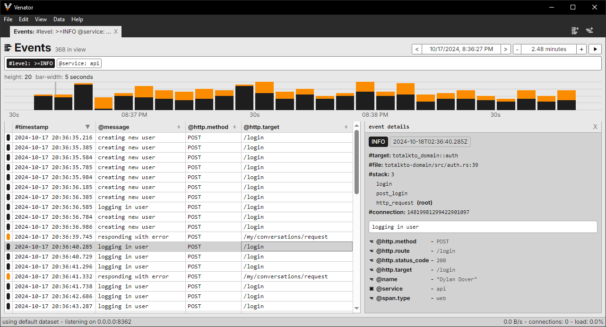
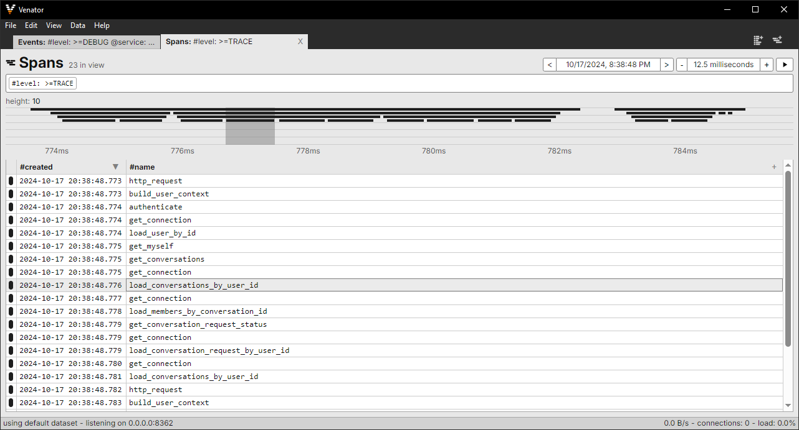
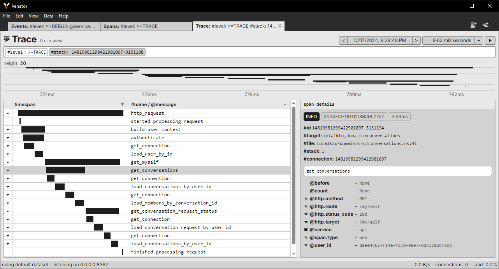

<p align="center">
  <picture>
    <source media="(prefers-color-scheme: dark)" srcset="docs/images/icon-dark.png">
    <source media="(prefers-color-scheme: light)" srcset="docs/images/icon-light.png">
    
  </picture>
</p>

Venator is a library and GUI application for recording, viewing, and filtering logs and spans from Rust programs instrumented with the tracing crate. It is purpose-built for rapid local development.

This is currently in a "beta" state; bugs and quirks are to be expected but functionality should be complete. Bug reports and future feature requests are welcome.

## Usage

In your instrumented program:

```toml
[dependencies]
venator = "0.1.0"
```

```rust
use venator::Venator;

Venator::default().install();
```

Installing the Venator app (Rust 1.76 or newer):

```
cargo install venator-app
```

```
venator
```

## Screenshots:

<picture>
  <source media="(prefers-color-scheme: dark)" srcset="docs/images/screenshot-events-dark.png">
  <source media="(prefers-color-scheme: light)" srcset="docs/images/screenshot-events-light.png">
  
</picture>
<picture>
  <source media="(prefers-color-scheme: dark)" srcset="docs/images/screenshot-spans-dark.png">
  <source media="(prefers-color-scheme: light)" srcset="docs/images/screenshot-spans-light.png">
  
</picture>
<picture>
  <source media="(prefers-color-scheme: dark)" srcset="docs/images/screenshot-traces-dark.png">
  <source media="(prefers-color-scheme: light)" srcset="docs/images/screenshot-traces-light.png">
  
</picture>
