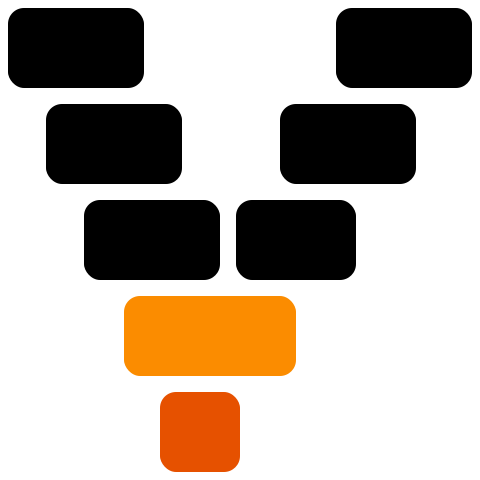
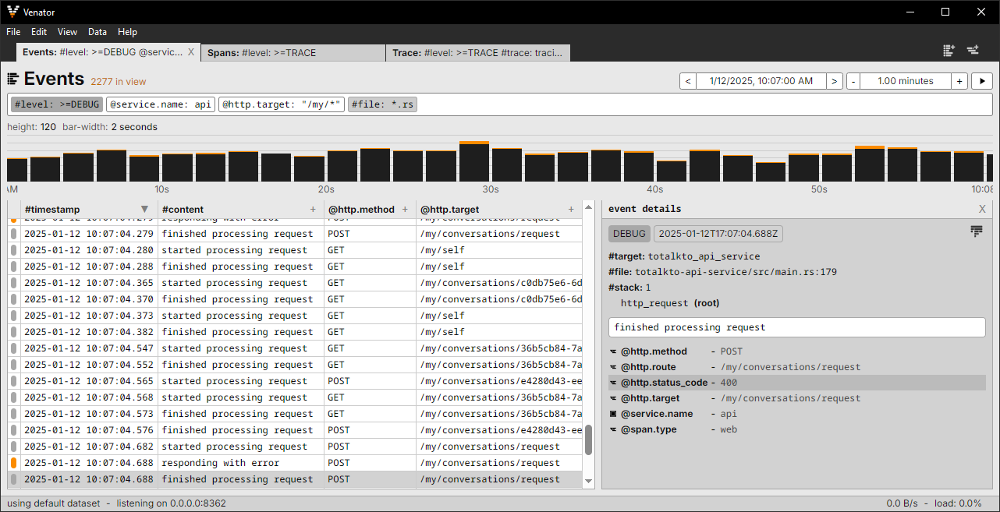

<p align="center">
  <picture>
    <source media="(prefers-color-scheme: dark)" height=170 srcset="docs/images/icon-dark.svg">
    <source media="(prefers-color-scheme: light)" height=170 srcset="docs/images/icon-light.svg">
    
  </picture>
</p>

Venator is a application for recording, viewing, and filtering logs and spans
from programs instrumented with the Rust tracing crate or using OpenTelemetry.
It is purpose-built for rapid local development.

<picture>
  
</picture>

## Installation

### With Cargo:

Compiling and installing `venator` source with Cargo requires Rust 1.76 or newer:

```
cargo install venator-app
```

### With Pre-built Binaries:

TBD

## Usage

### Using Rust Tracing:

In your instrumented program:

```toml
[dependencies]
venator = "1.0.0"
```

```rust
use venator::Venator;

Venator::default().install();
```

See the [documentation](https://docs.rs/venator/latest/venator/) for more.

### Using OpenTelemetry:

Configure your program's OpenTelemetry SDK to export logs and traces to
`127.0.0.1:8362` (the default for Venator) and to use GRPC or HTTP with binary
encoding.

## Features:

Events can be viewed narrowed by timespan and filtered by attributes, level, and
other properties. The table of records can include columns of custom properties.
The graph shows the counts by level at each bar.

<picture>
  
</picture>

Spans can likewise be narrowed by timespan and filter. A detail pane can show
all the properties of selected events and spans. The graph shows spans layered
hierarchically.

<picture>
  
</picture>

Traces can be viewed that show both events and spans within a single execution.

<picture>
  
</picture>
