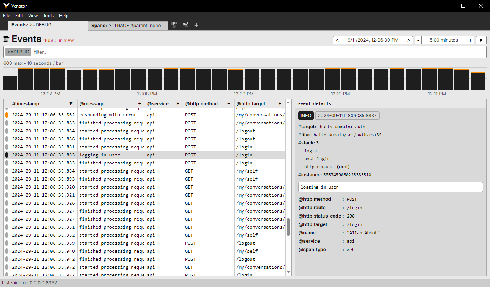
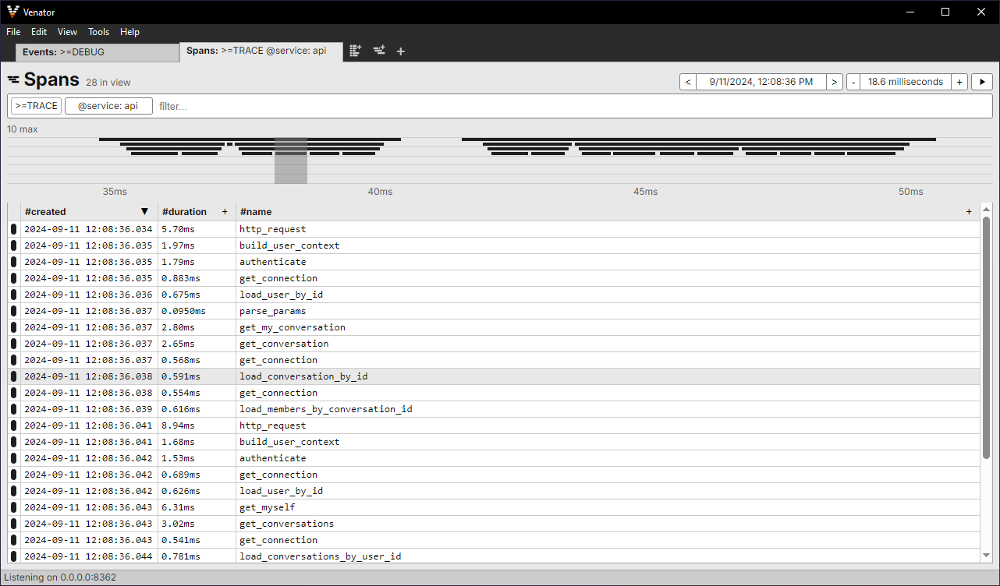
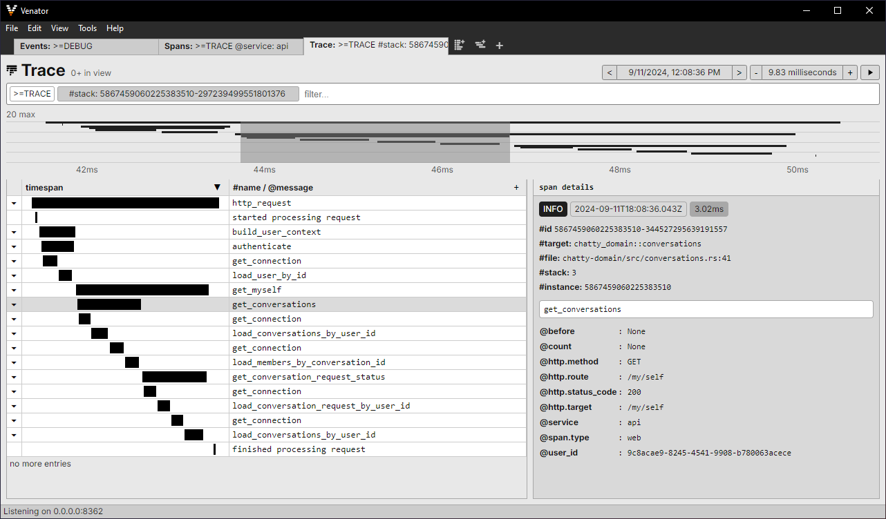

<p align="center">
    
</p>

Venator is a library and GUI application for recording, viewing, and filtering logs and spans from Rust programs instrumented with the tracing crate. It is purpose-built for rapid local development.

This is currently in an "alpha" state; bugs, quirks, and missing functionality are to be expected. Bug reports and feature requests are welcome.

## Usage

In your instrumented program:

```toml
[dependencies]
tracing = "0.1.40"
tracing-subscriber = "0.3.18"
venator = "0.1.0"
```

```rust
use tracing_subscriber::{layer::SubscriberExt, util::SubscriberInitExt};
use venator::Venator;

tracing_subscriber::registry()
    .with(Venator::builder()
    	.with_host("localhost:8362")         // optional, this is the default
    	.with_attribute("service", "my_app") // provide any top-level attributes
    	.build()
    )
    .init();
```

Installing the Venator app (Rust 1.76 or newer):

```
cargo install venator-app
```

## Screenshots:




